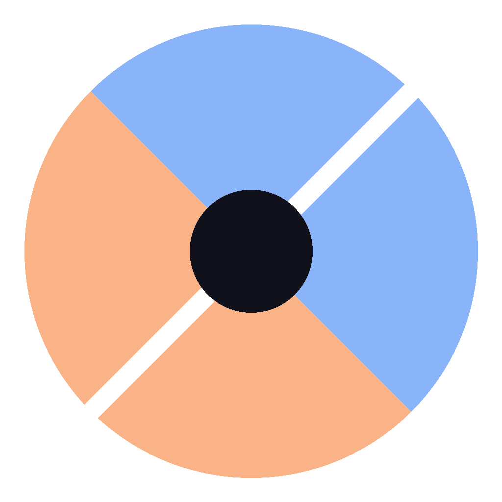
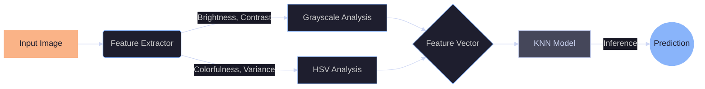

<div align="center">
  
  
  <h1>Day/Night Vision</h1>
  
  <p>
    <strong>Enterprise-grade environmental illumination classification system.</strong>
  </p>

  <!-- Badges: Catppuccin Mocha Themed -->
  <p>
    <a href="https://daynightclassifier.streamlit.app/">
      
    </a>
    
    
    
  </p>
</div>

---

## 📋 Overview

**Day/Night Vision** is a robust computer vision pipeline designed to classify scenes based on ambient lighting conditions. It leverages a K-Nearest Neighbors (KNN) algorithm trained on custom-extracted HSV (Hue, Saturation, Value) and Grayscale features, delivering high-performance inference suitable for edge deployment.

The interface is built with **Streamlit**, featuring a custom **Catppuccin Mocha** design system for a cohesive, dark-mode-first user experience.

## 🏗️ Architecture

This project follows a modular MLOps architecture, ensuring separation of concerns between feature extraction, training, and inference.



## 🚀 Quick Start

### 1. Cloud Demo
Experience the live application instantly: **[Launch Dashboard](https://daynightclassifier.streamlit.app/)**

### 2. Local Deployment (uv)
We recommend `uv` for lightning-fast dependency management.

```bash
# Clone the repository
git clone https://github.com/your-username/day-night-classifier.git
cd day-night-classifier

# Install dependencies and run
uv run streamlit run gui_app/app.py
```

### 3. Docker Container
Run the entire stack in an isolated container.

```bash
docker compose up --build
```
*Access the dashboard at `http://localhost:8501`*

## 🛠️ Tech Stack

| Component | Technology | Description |
| :--- | :--- | :--- |
| **Core Logic** | Python 3.12 | Feature extraction & glue code |
| **ML Engine** | Scikit-Learn | KNN Classifier (k=3, Euclidean) |
| **Imaging** | Pillow / Scikit-Image | Image processing & transformation |
| **Frontend** | Streamlit | Interactive web dashboard |
| **Styling** | CSS / Catppuccin | Custom "Mocha" design system |
| **DevOps** | Docker / Kubernetes | Containerization & Orchestration |

## 📊 Feature Engineering

The model relies on 4 key engineered features rather than raw pixel data, making it lightweight and interpretable:

1.  **Brightness (`μ`):** Mean pixel intensity (Grayscale).
2.  **Contrast (`σ`):** Standard deviation of pixel intensity.
3.  **Colorfulness:** Mean Saturation (S-channel in HSV).
4.  **Color Variance:** Standard deviation of Hue (H-channel in HSV).

## 📂 Repository Structure

```text
.
├── dataset/                # Raw training images
├── docs/                   # Detailed documentation
├── gui_app/                
│   ├── app.py              # Main dashboard entrypoint
│   └── assets/             # Model artifacts (.joblib) & icons
├── k8s/                    # Kubernetes manifests
├── feature_extractor.py    # ETL script for image data
├── train_and_save_model.py # Training pipeline
├── generate_assets.py      # Procedurally generates UI assets (Logo)
└── pyproject.toml          # Dependency configuration
```

## 📜 License

Distributed under the MIT License. See `LICENSE` for more information.

---
<div align="center">
  <small>Designed with 💜 and ☕ (Catppuccin Mocha)</small>
</div>
