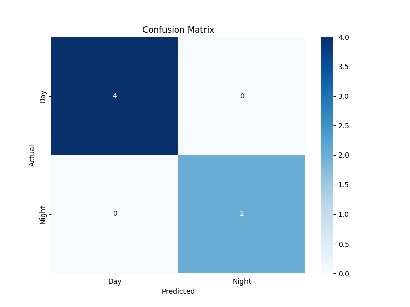

# Day/Night Scene Classifier

A Python-based machine learning project that classifies images as 'Day' or 'Night'. This project uses a K-Nearest Neighbors (KNN) classifier trained on objective, computationally-extracted visual features. It includes a command-line script for model evaluation and a web-based GUI for interactive predictions.

This project demonstrates a complete machine learning workflow, from feature engineering and model training to deployment with an interactive user interface.

---

## 📂 Project Structure

```
day-night-classifier/
├── dataset/                  # Image dataset (20 images)
├── gui_app/                  # Web-based GUI
│   ├── app.py                # The Streamlit GUI application
│   ├── assets/               # Saved model, scaler, and label encoder
│   └── requirements.txt      # Python dependencies for the GUI app
├── pyEnv/                    # Python virtual environment
├── README.md                 # This file
├── analysis.md               # In-depth analysis of the model and results
├── classifier_code.py        # Script to train and evaluate the classifier
├── confusion_matrix.png      # Output plot from the classifier evaluation
├── feature_extractor.py      # Script to extract features from images
├── feature_table.csv         # The final, computed features for each image
└── train_and_save_model.py   # Script to train and save the model
```

---

## ✨ Features

-   **Objective Feature Extraction:** Automatically calculates 4 distinct visual features for each image: `brightness`, `contrast`, `colorfulness`, and `color_variety`.
-   **KNN Classifier:** A simple yet powerful K-Nearest Neighbors model for classification.
-   **Interactive GUI:** A user-friendly web interface built with Streamlit that allows you to upload your own images for classification.
-   **Reproducible Workflow:** The entire pipeline, from feature extraction to model training and evaluation, is scripted and reproducible.

---

## 🚀 Getting Started

### 1. Prerequisites

-   Python 3.8+

### 2. Installation & Setup

1.  **Clone the repository:**
    ```bash
    git clone <repository-url>
    cd day-night-classifier
    ```

2.  **Create and activate a virtual environment:**
    It is recommended to use a virtual environment to keep the project's dependencies isolated. You can create one using `venv`:
    ```bash
    python3 -m venv env
    source env/bin/activate
    ```

3.  **Install dependencies:**
    The required Python packages are listed in `gui_app/requirements.txt`. Install them using pip:
    ```bash
    pip install -r gui_app/requirements.txt
    ```

---

## Workflow

This project is divided into three main scripts that should be run in the following order:

1.  **`feature_extractor.py`**: This script iterates through the images in the `dataset` directory, calculates the four visual features for each image, and prints the results to standard output in CSV format.

2.  **`train_and_save_model.py`**: This script takes the `feature_table.csv` generated by the feature extractor, trains a K-Nearest Neighbors (KNN) classifier on the **entire** dataset, and then saves the trained model, the feature scaler, and the label encoder to the `gui_app/assets` directory. These saved assets are then used by the GUI application.

3.  **`classifier_code.py`**: This script also uses the `feature_table.csv`. It splits the data into a training set (70%) and a testing set (30%), trains a KNN model on the training data, and then evaluates its performance on the testing data. It prints a detailed classification report to the console and generates a `confusion_matrix.png` image to visualize the model's accuracy.

---

## Usage

There are two main ways to use this project:

**A) Run the Interactive GUI (Recommended)**

This is the easiest way to test the model. After following the installation and setup instructions, run the following command:

```bash
streamlit run gui_app/app.py
```

This will start a local web server and open the GUI in your browser. You can then upload your own images to see the model's predictions in real-time.

**B) Re-run the Full Pipeline**

If you want to regenerate all the project's artifacts from scratch, follow these steps in order:

1.  **Generate the feature table:**
    ```bash
    python feature_extractor.py > feature_table.csv
    ```
    *Note: This will overwrite the existing `feature_table.csv`. If you want to preserve the original labels, you will need to manually copy the `Class` column from the old file to the new one.*

2.  **Train and save the model:**
    ```bash
    python train_and_save_model.py
    ```

3.  **Evaluate the model:**
    ```bash
    python classifier_code.py
    ```
    This will print the classification report and update the `confusion_matrix.png`.

---

## 📊 Analysis & Results

For a detailed breakdown of the model's performance, feature selection rationale, and design choices, see the full [Project Analysis](./analysis.md).

The model's performance on the test set is summarized in the following confusion matrix:



As you can see, the model achieved 100% accuracy on the test set.